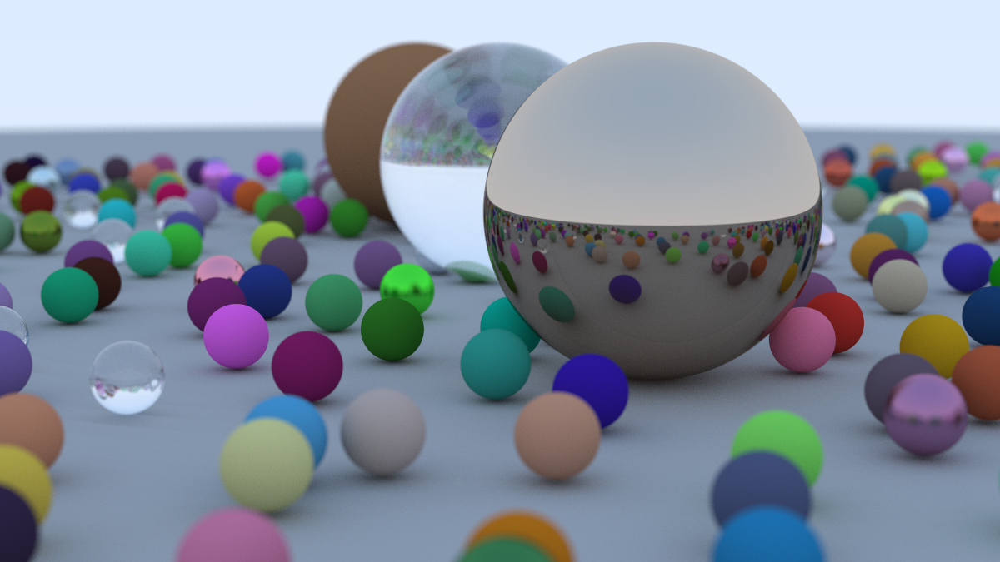

# ray_tracing
Ray tracing in a weekend implemented in Rust

Followed the tutorial given by this great book:
https://raytracing.github.io/books/RayTracingInOneWeekend.html#overview 

## Final render!
